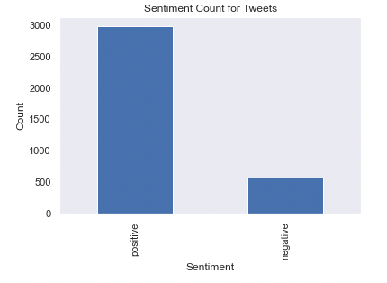
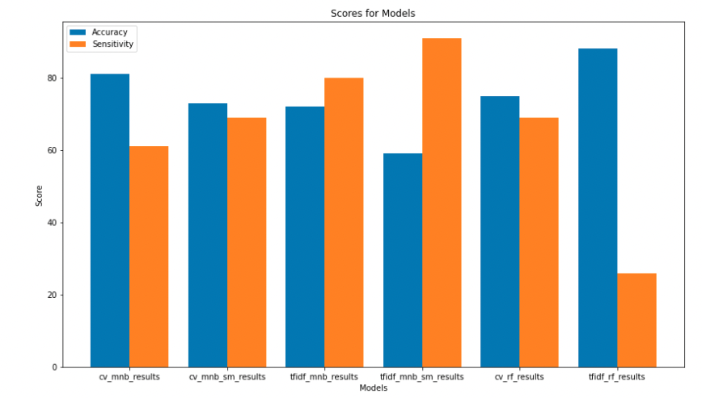
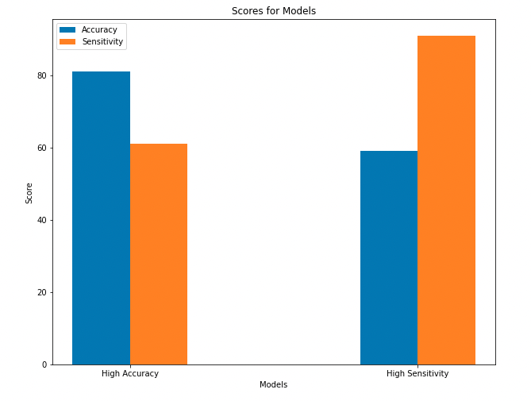

# Discorvering Negative Tweets 

**Authors**: Jeonwook Kang, Mendy Nemanow, Zach Hanly

## Overview

We used twitter data in order to build a model that performs sentiment analysis. The data we used can be found [here](https://data.world/crowdflower/brands-and-product-emotions) and was previously labeled with sentiments by other contributors. From those contributors of the data set: 
<blockquote cite="https://kingcounty.gov/about/website/Transparency.aspx">
"Contributors evaluated tweets about multiple brands and products. The crowd was asked if the tweet expressed positive, negative, or no emotion towards a brand and/or product. If some emotion was expressed they were also asked to say which brand or product was the target of that emotion."</blockquote>

## Business and Data Understanding

We started a business where we help technology companies find ways to analyze tweets about their company and products. We have developed a model that helps social media departments filter through tweets that reference their company and/or their products and find potentially negative tweets so that they may then address them. This not only helps these companies find customers that are not happy with their company, but also serves as a way for them to reach out with unsatisfied customers in an expedite way. 

### Data Class Imbalance 


## Modeling

### All Models 


### Top 2 models


## Conclusion

The company that uses this model will have to make a decision between prioritizing overall accuracy, or just focusing on finding the negative tweets. You can also use one of the models that have more balanced results, but that means compromizing on both accuracy and sensitivity. We imagine that different companies will prioritize different things.

## For More Information

Please review our full analysis in our [Jupyter Notebook](./Main_Notebook.ipynb) or our [presentation](./presentation.pdf).

## Repository Structure

```
├── data                      <- Sourced externally
├── images                    <- Generated from code
├── mendy                     <- individual contributor
├── zach                      <- individual contributor 
├── .gitignore                <- filed github should ignore 
├── Main_Notebook.ipynb       <- Narrative documentation of analysis in Jupyter notebook
├── README.md                 <- The top-level README for reviewers of this project
├── presentation.pdf          <- PDF version of project 
```# product_sentiment_nlp
